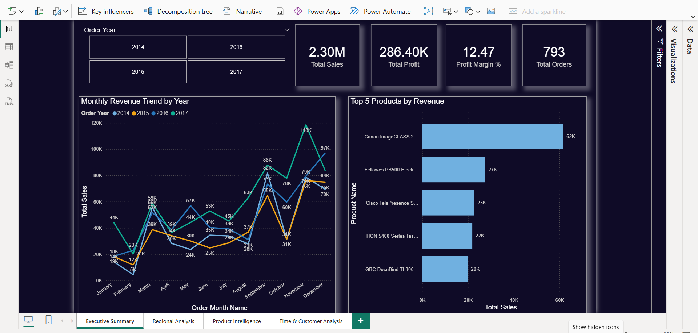
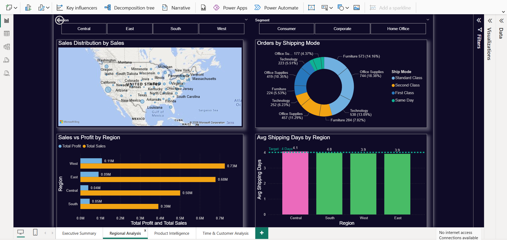
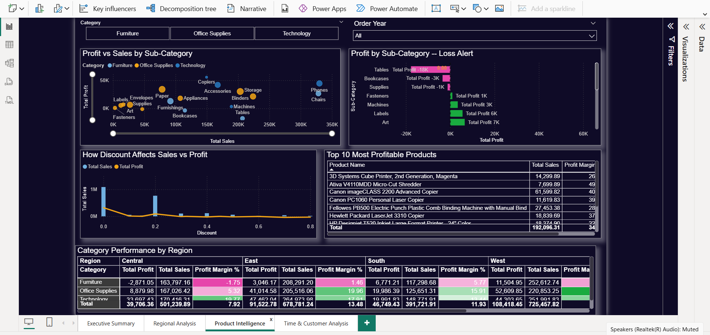
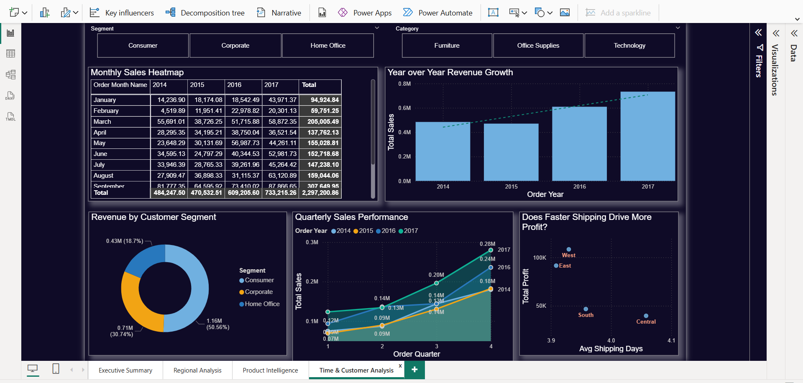
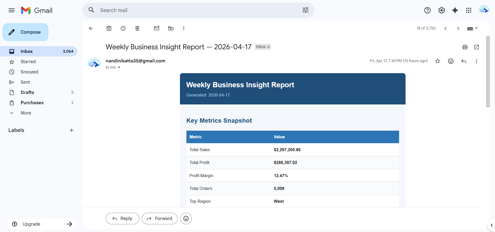
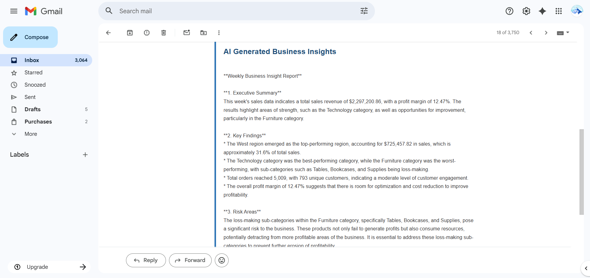

# 🚀 AI-Powered Sales Dashboard with Automated Insights

An end-to-end data analytics and AI pipeline that transforms raw sales data into actionable business intelligence. This project moves beyond static visuals by using **Generative AI** to automate executive summaries and report delivery.

-----

## 📌 Problem Statement

In modern business environments, data volume is rarely the issue—**speed to insight** is. Many organizations struggle with:

  * **Manual Bottlenecks:** Spending hours cleaning data and writing weekly summaries.
  * **Static Reporting:** Dashboards that show *what* happened but not *why* or *what to do next*.
  * **Delayed Decisions:** Human-dependent analysis cycles that lag behind real-time market changes.

**The Solution:** A fully automated pipeline that cleans data, updates visuals, generates AI-driven commentary, and notifies stakeholders via email.

-----

## 📂 Project Architecture

The workflow follows a modular data engineering pattern:

1.  **Ingestion:** Raw `CSV` dataset (Superstore Sales).
2.  **Processing:** `Python (Pandas)` for data cleaning and transformation.
3.  **Analysis:** `SQL` for feature engineering and complex aggregations.
4.  **Visualization:** `Power BI` for interactive, drill-down exploration.
5.  **Intelligence:** `GPT API` analyzes processed metrics to generate natural language insights.
6.  **Delivery:** Automated email reports sent via `SMTP`.

-----

## 📈 Dashboard Preview

## 📈 Dashboard Deep-Dive

<details>
<summary><b>🔍 Click to view all 4 Dashboard Views</b></summary>

### 1. Main Executive Dashboard


### 2. Regional Sales Breakdown


### 3. Category & Product Trends


### 4. Automated AI Insights Module


</details>


### Key Features:

  * **Real-time KPIs:** Total Sales, Profit Margins, and Year-over-Year (YoY) growth.
  * **Trend Analysis:** Time-series forecasting for inventory planning.
  * **Geographic Insights:** Heatmaps identifying high-performing regions.

-----

## 📧 Automated AI Report

Instead of just looking at graphs, stakeholders receive an automated email summary that looks like this:
---

## 📧 Automated AI Report Delivery

The final step of the pipeline automatically triggers an email to stakeholders. This contains a natural language summary generated by the AI, highlighting trends that require immediate attention.

## 📧 Automated AI Report Delivery

The final step of the pipeline automatically triggers an email to stakeholders. This contains a natural language summary generated by the AI, highlighting trends that require immediate attention.

<p align="center">
  
  
</p>

> **Key Automation Logic:** The `auto_report.py` script parses the latest SQL results, sends them to the GPT API for summarization, and uses the `SMTP` library to dispatch this formatted HTML email.

-----

## ⚙️ Automation Workflow

To update the entire system, simply update the source file and run:

```bash
python auto_report.py
```

| Step | Action | Outcome |
| :--- | :--- | :--- |
| **1** | Update Dataset | New raw data added to `data/` |
| **2** | Run Script | Python cleans data & triggers GPT API |
| **3** | AI Generation | Executive summary generated based on new trends |
| **4** | Notification | Stakeholders receive automated email |
| **5** | Refresh BI | Click 'Refresh' in Power BI to sync visuals |

-----

## 🛠️ Tech Stack

  * **Language:** Python (Pandas, NumPy, SQLAlchemy)
  * **Database:** SQL (PostgreSQL/SQLite) for structured querying
  * **BI Tool:** Power BI / DAX
  * **AI Model:** OpenAI GPT-4 API (via LangChain or OpenAI Python SDK)
  * **Automation:** SMTP for Email, GitHub Actions (optional for scheduling)

-----

## 📌 Business Impact

  * **Efficiency:** Reduces manual reporting effort by \~80%.
  * **Speed:** Transforms raw data to executive insights in under 60 seconds.
  * **Accuracy:** Eliminates human error in data cleaning and calculation.
  * **Proactive Growth:** Highlights anomalies and opportunities that might be missed by the naked eye.


-----

### ⭐ Support

If you find this project helpful, please give it a **Star** and connect with me on [LinkedIn](https://www.google.com/search?q=your-profile-link)\!
