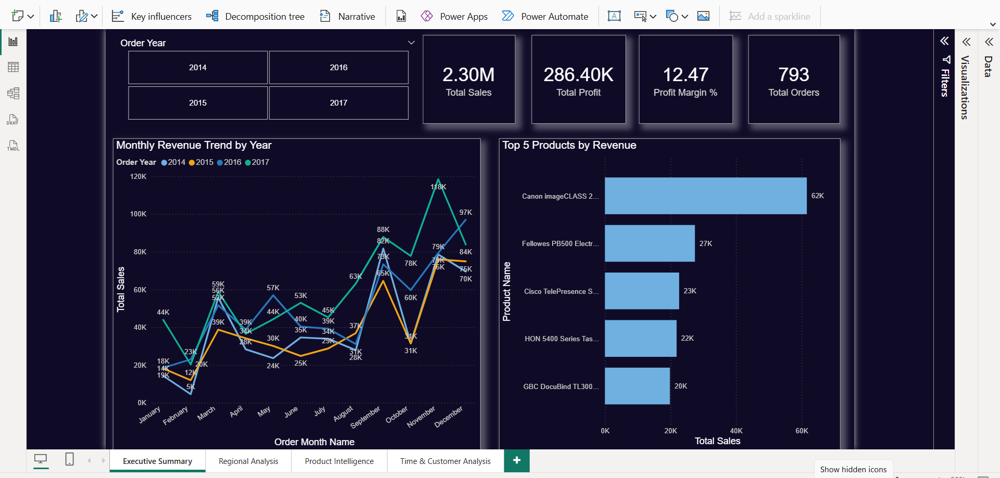
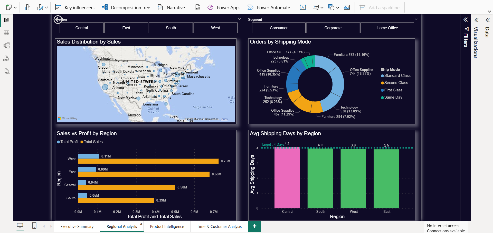
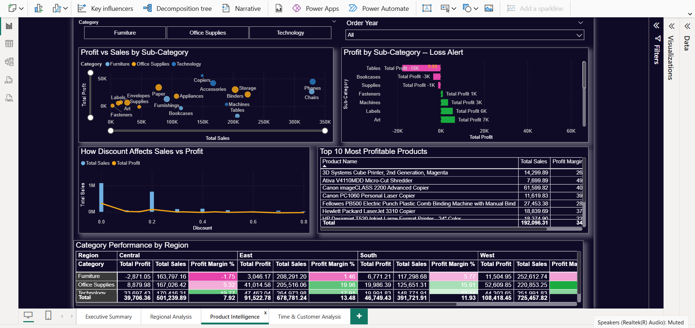
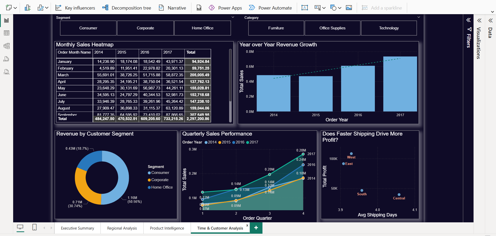
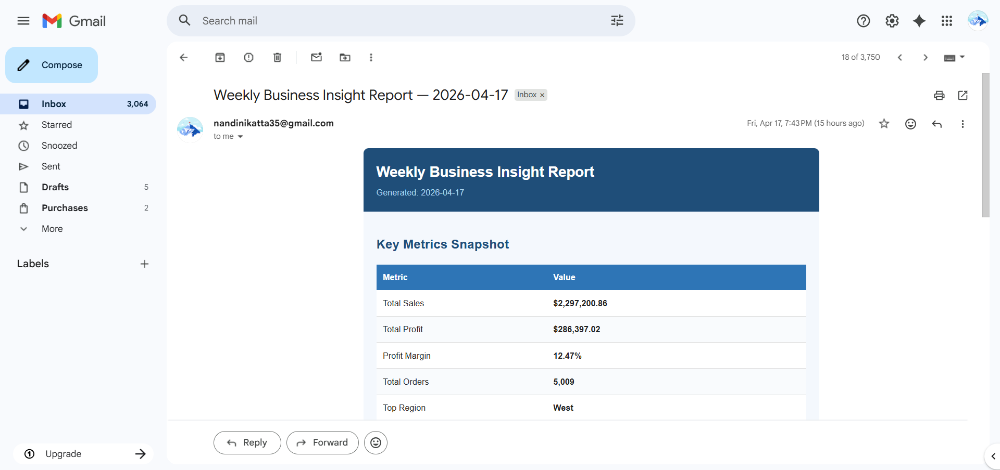
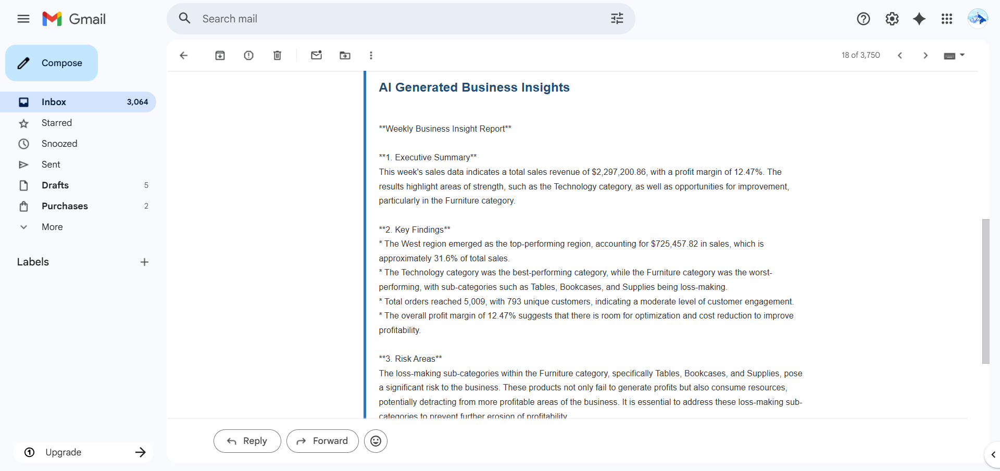

# Sales Analytics & Automated Insight Pipeline

An end-to-end analytics pipeline on the Superstore sales dataset: data
cleaning and validation in pandas, a Power BI dashboard for exploration, and
a small automation layer that turns computed metrics into a plain-English
report via an LLM and delivers it by email.

## Tools

Python (pandas, matplotlib, seaborn) · SQL-style aggregation in pandas ·
Power BI · Groq API (Llama 3.3) · pytest

## Data Source

[Superstore Sales dataset](https://www.kaggle.com/datasets/vivek468/superstore-dataset-final)
— a widely-used public retail dataset, included in `data/`. This project's
goal wasn't to prove the data was messy (it isn't — see below), but to build
a defensible metrics pipeline and a working automation layer on top of it.

## Key Findings

**1. Discount depth, not category, is the main driver of unprofitable orders.**
Discount and profit margin are strongly negatively correlated (**r = -0.86**).
Orders discounted 30% or more make up only ~14% of all orders but account
for **87% of total losses** ($135K of $156K). Average margin turns negative
once a discount passes roughly 20%.

**2. Furniture is the only structurally unprofitable category**, driven
almost entirely by three sub-categories — Tables, Bookcases, and Supplies —
which lose money even before accounting for heavy discounting.

**3. Technology is the strongest performer** by both sales and profit,
suggesting discount policy there could be looser without risking margin,
while Furniture discounting needs tighter control.

**4. 18.7% of all orders lose money.** That's a large enough share that
discount approval — not occasional pricing mistakes — looks like the
underlying cause, not an edge case.

See `data/notebooks/01_data_cleaning.ipynb` for the full analysis, including
the data quality checks that back these numbers.

## Data Quality Checks Performed

Before trusting any metric, the cleaning notebook explicitly checks for:
duplicate rows (none found), missing values (none found), `Row ID`
uniqueness as a primary key (confirmed), and out-of-range values in Sales,
Quantity, and Discount (none found). This dataset happens to be clean at
the source — the point of running these checks isn't to manufacture a
cleaning story, it's to *verify* that before computing anything downstream,
rather than assume it.

## The Automation Layer

`scripts/metrics.py` computes the business metrics above and builds an LLM
prompt from them; `scripts/insight_generator.py` runs that once and saves
the report; `scripts/autoreport.py` does the same on a schedule and emails
the result. To be precise about what the "AI" part actually does: it turns
already-computed statistics into readable prose and recommendations — the
analysis itself (discount correlation, loss-making sub-categories, etc.) is
plain pandas, not the model guessing at the data.

python scripts/insight_generator.py # generate + save a report
python scripts/autoreport.py # generate, save, and email a report

## Setup
pip install -r requirements.txt
cp .env.example .env # then fill in your own GROQ_API_KEY, EMAIL_SENDER, EMAIL_PASSWORD
`EMAIL_PASSWORD` should be a Gmail [app password](https://myaccount.google.com/apppasswords),
not your regular account password.

## Testing
Unit tests cover `scripts/metrics.py` against a small hand-built dataset
with known expected outputs (total sales, profit margin, top region,
loss-making sub-categories, etc.), so a change to the metric logic that
breaks a number is caught immediately rather than only showing up in a
generated report.

## Dashboard Preview

<table>
  <tr>
    <td align="center" width="50%">
      <b>1. Main Executive Dashboard</b> 
      
    </td>
    <td align="center" width="50%">
      <b>2. Regional Sales Breakdown</b> 
      
    </td>
  </tr>
  <tr>
    <td align="center" width="50%">
      <b>3. Category & Product Trends</b> 
      
    </td>
    <td align="center" width="50%">
      <b>4. Automated AI Insights Module</b> 
      
    </td>
  </tr>
</table>

## Automated Email Report

`autoreport.py` sends a formatted HTML email with the key metrics table and the AI-generated narrative report.

<table>
  <tr>
    <td align="center" width="50%">
      
    </td>
    <td align="center" width="50%">
      
    </td>
  </tr>
</table>

## Project Structure
ai-sales-dashboard/
├── data/
│   ├── Sample - Superstore.csv      # raw source data
│   ├── superstore_cleaned.csv       # output of the cleaning notebook
│   └── notebooks/
│       └── 01_data_cleaning.ipynb   # cleaning, validation, and EDA
├── output/                          # charts, dashboard screenshots, generated reports
├── scripts/
│   ├── metrics.py                   # shared metric calculations + LLM prompt
│   ├── insight_generator.py         # one-off report generation
│   └── autoreport.py                # scheduled report generation + email
├── tests/
│   └── test_metrics.py              # unit tests for metrics.py
├── sales_dashboard.pbix             # Power BI dashboard
├── requirements.txt
└── .env.example

## Status
✅ Complete